  
# 👋 Olá, eu sou o Saulo Pavanello!

 

  
 
 

  
## 💻 Sobre mim

🎨 **Ex-UI Designer** | Trago a precisão do design para o desenvolvimento de interfaces modernas e intuitivas.

🎓 **Software Engineering** | Graduando na Anhanguera, focando em arquitetura e boas práticas de engenharia.

👨‍🏫 **React Instructor** | Instrutor na Udemy do curso **"React Pro - Do Zero ao Mercado"**, compartilhando conhecimento com a comunidade.

🛠️ **Full Stack Developer** | Desenvolvendo soluções robustas como o **Lume** (Fintech/ADHD) e sistemas de automação para E-commerce.

📍 Localizado em **Dois Irmãos - RS, Brasil**.

🇮🇹 Em processo de cidadania italiana, focado em expandir minha carreira no mercado europeu.

---

### 🎓 Educação & Ensino

 

📚 Atualmente cursando **Engenharia de Software** na Anhanguera.
👨‍🏫 Instrutor do curso **"React Pro - Do Zero ao Mercado"** na Udemy.

## 🛠️ Projetos em Destaque

---

  
## 🚀 Tecnologias e Ferramentas

### 🔹 Front-end (Web & Mobile)

### 🔹 Back-end

### 🎮 Game Development

### 🔹 Ferramentas & Design

 

### 📊 Minha Telemetria

  
## 🌎 Conecte-se comigo  

 

